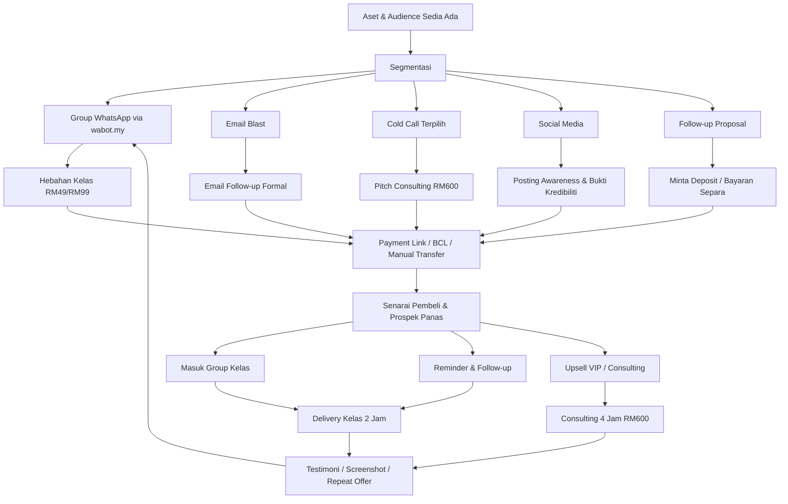
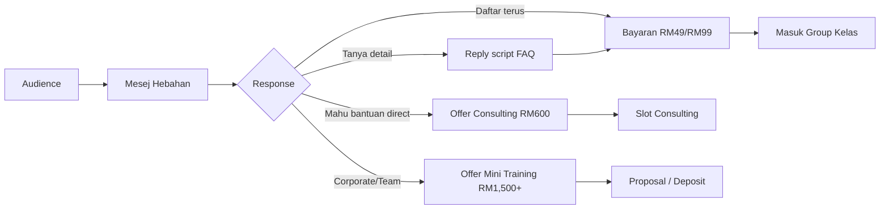

# Gambaran Sistem Hebahan Misi Tunai

Hub berkaitan: [[Misi Tunai Julai 2026]]

Nota berkaitan:

- [[2026-07-13 - Brainstorm Pipeline Hebahan dan Consulting]]
- [[2026-07-13 - Audit Local Drive Peluang Duit]]
- [[2026-07-13 - Audit Google Drive Peluang Duit]]
- [[2026-07-12 - Pelan Tunai Segera]]

## Objektif Sistem

Sistem hebahan ini bukan sekadar blast mesej. Tujuannya ialah membawa orang daripada audience sedia ada kepada tindakan bayaran yang jelas.

Fokus semasa:

- Kumpul tunai sebelum 20 Julai 2026.
- Guna channel yang sudah ada: wabot.my, group WhatsApp, email, cold call, social media, dan follow-up proposal.
- Jual offer yang boleh dibayar cepat dan dihantar cepat.

## Diagram Pipeline

## Aliran Kerja Ringkas

### 1. Kumpul dan segmentasi audience

Sumber audience:

- Group alumni dalam wabot.my.
- CSV group WhatsApp dalam `Downloads\scrap` dan `Downloads\insken`.
- Contact list WhatsApp.
- Business list SME.
- Prospek dari Google Drive / proposal lama.
- Prospek training provider.

Status group perlu ditanda:

- `boleh hantar`
- `only admin can send`
- `inactive`
- `tidak relevan`

### 2. Offer utama

Offer utama untuk cash cepat:

**Klinik AI Jualan & WhatsApp Automation 2 Jam**

Janji offer:

Dalam 2 jam, peserta bina:

- 1 offer yang jelas
- 3 skrip WhatsApp follow-up
- 10 idea content jualan
- 1 flow broadcast ringkas
- cara guna AI untuk susun mesej dan follow-up

Harga:

- RM49 early bird
- RM99 normal
- RM199 VIP review offer/script
- RM600 consulting 4 jam untuk yang mahu bantuan direct

### 3. Channel hebahan

#### Channel A: Group WhatsApp via wabot.my

Fungsi:

- Hebahan paling cepat.
- Sesuai untuk alumni dan group kelas lama.

Risiko:

- Ada group `only admin can send`.
- Jangan hantar terlalu agresif.
- Perlu test batch kecil dahulu.

Cadangan:

- Batch 1: group AI, BCL, digital product, alumni.
- Batch 2: group TikTok/Shopee/Lazada.
- Batch 3: group umum yang masih relevan.

#### Channel B: Email blast

Fungsi:

- Follow-up formal.
- Baik untuk database lama dan prospek yang tidak aktif di WhatsApp.

Cadangan:

- Email 1: jemputan kelas.
- Email 2: reminder seat early bird.
- Email 3: replay/last call.

Perlu:

- Nama platform kirim email.
- API docs/API key jika mahu sambung terus dengan Codex.
- Link unsubscribe atau cara opt-out.

#### Channel C: Cold call terpilih

Fungsi:

- Untuk prospek SME yang lebih bernilai.
- Bukan untuk volume besar.

Offer sesuai:

- Consulting 4 jam RM600.
- Audit AI Jualan Ekspres RM199/RM299.
- Mini training team RM1,500.

#### Channel D: Social media

Fungsi:

- Bina keyakinan dan bukti.
- Sokong WhatsApp/email, bukan channel utama cash segera.

Platform:

- Facebook
- TikTok
- LinkedIn
- X/Twitter
- YouTube
- Google Business Profile

Jenis posting:

- Masalah: banyak lead tapi sales bocor.
- Demo: AI bina skrip follow-up.
- Bukti: pengalaman trainer / kelas lama.
- CTA: join klinik / booking consulting.

#### Channel E: Follow-up proposal

Fungsi:

- Ticket besar.
- Bayaran mungkin lambat, tetapi deposit boleh dikejar.

Target:

- MCMC
- AIMM
- MPKS
- JPM
- MPPJ
- Banking
- Hartanah
- SIRIM / projek terdahulu

CTA:

- Tanya status.
- Minta tarikh keputusan.
- Offer sesi pendek 2 jam.
- Minta deposit untuk lock tarikh.

## Funnel Jualan

## KPI Ringkas

| Aktiviti | Sasaran Minimum |
|---|---:|
| Group yang diaudit | 50 |
| Group yang boleh hantar | 20 |
| Hebahan batch pertama | 10-20 group |
| Pembeli kelas RM49/RM99 | 20-40 orang |
| VIP RM199 | 5-8 orang |
| Consulting RM600 | 1-3 klien |
| Deposit corporate/proposal | 1 pembayaran |

## Gambar Besar

Sistem ini ada 3 lapisan:

1. **Volume cepat**: group WhatsApp + kelas RM49/RM99.
2. **Ticket sederhana**: VIP RM199 + Audit AI Jualan RM199/RM299.
3. **Ticket tinggi**: consulting RM600 + corporate mini training + follow-up proposal.

Keutamaan minggu ini ialah volume cepat dan ticket sederhana dahulu. Ticket tinggi dikejar serentak, tetapi tidak boleh menjadi satu-satunya harapan kerana cycle bayaran lebih lambat.

