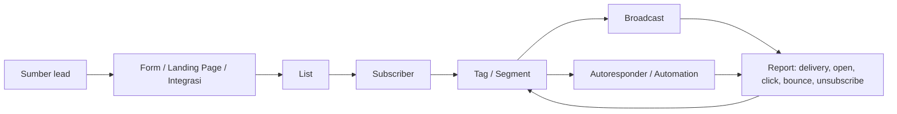

# Sistem Kirim.Email — Peta Fungsi & Panduan Operasi

> [!info] Status nota
> Kajian dokumentasi rasmi, laman produk dan audit baca-sahaja terhadap akaun sebenar diselesaikan pada **16 Julai 2026**. Fungsi dashboard semasa telah dibandingkan dengan dokumentasi lama. Tiada e-mel dihantar dan tiada tetapan diubah semasa audit.

## Ringkasan satu ayat

Kirim.Email ialah infrastruktur dan aplikasi pemasaran e-mel untuk mengumpul audiens, mengurus list, membina e-mel/landing page, menghantar broadcast, menjalankan autoresponder/automation, mengukur respons dan menghantar e-mel transaksional melalui API atau SMTP.

## Ekosistem Kirim.Email

Kirim.Email memisahkan beberapa permukaan:

1. **Membership** — akaun, servis aktif/tamat, invois, profil, keselamatan, affiliate dan akses ke aplikasi.
2. **Application** — operasi pemasaran: list, subscriber, form, landing page, broadcast, autoresponder, automation dan integrations.
3. **Documentation** — panduan penggunaan produk.
4. **Academy** — strategi pemasaran, copywriting, trafik dan kempen; biasanya memerlukan akaun.
5. **Developer/Transactional** — API, SMTP, SDK, webhook, domain dan log untuk e-mel produk seperti OTP, notifikasi dan invois.

## Dua kegunaan utama

### Marketing Email

Sesuai untuk:

- newsletter;
- promosi berkala;
- nurture lead;
- onboarding subscriber;
- kempen berdasarkan minat/tingkah laku;
- landing page dan opt-in form;
- automation pemasaran.

Model harga semasa menerangkan pelan marketing berdasarkan jumlah contact dengan penghantaran tanpa had tertakluk kepada terma pelan.

### Transactional Email

Sesuai untuk e-mel yang dicetuskan sistem:

- OTP;
- pengesahan pendaftaran;
- reset kata laluan;
- status pesanan;
- resit/invois;
- notifikasi aplikasi.

Saluran teknikal termasuk REST API, SMTP, SDK dan webhook. Kredensial SMTP, API key dan webhook secret tidak patut disimpan dalam nota Obsidian biasa.

## Model data asas

- **List** ialah bekas utama subscriber.
- **Subscriber** ialah contact yang boleh mempunyai nama, e-mel, telefon dan field tambahan.
- **Tag** memberi penanda yang boleh digunakan dalam segmentasi/automation.
- **Segment** ialah kumpulan dinamik berdasarkan atribut atau tingkah laku.

## Modul utama

### Lists & Subscribers

List diperlukan sebelum membina form, menghantar broadcast atau menjalankan autoresponder.

Tetapan list yang diterangkan dalam dokumentasi:

- internal name — nama untuk pasukan;
- public name — nama yang boleh dilihat subscriber;
- public status;
- default subscriber fields;
- confirmation email template.

Cara memasukkan subscriber:

- form atau landing page;
- Google Sheets/Google Forms sync;
- integrasi e-dagang/WordPress/Facebook dan lain-lain;
- import copy-paste;
- fail CSV/XLSX;
- migration tools.

> [!danger] Polisi data
> Jangan import senarai yang dibeli, dicuri atau tiada bukti izin. Dokumentasi menyatakan import boleh melalui semakan dan akaun boleh disekat jika data melanggar polisi. Kaedah opt-in dan integrasi sumber asal lebih selamat.

### Segments

Segment boleh dibina melalui menu Lists atau ketika menentukan penerima broadcast.

Contoh syarat:

- open / not opened;
- click / not clicked;
- berada atau tidak berada dalam list;
- domain e-mel;
- mempunyai tag;
- tarikh subscribe;
- negara, negeri, bandar atau zon masa;
- subscriber rating;
- gabungan syarat AND/OR.

Kegunaan praktikal:

- resend dengan sudut baharu kepada yang tidak membuka;
- follow-up orang yang klik tetapi belum membeli;
- re-engage subscriber lama;
- elakkan menghantar promosi yang tidak relevan.

### Forms & Landing Pages

Fungsi utama:

- bina form atau landing page secara drag-and-drop;
- pilih list destinasi;
- simple opt-in, single opt-in atau double opt-in;
- tetapkan field yang dikumpul;
- tetapkan mesej/halaman selepas sign-up;
- copy atau move subscriber mengikut aturan;
- publish melalui URL, QR code atau custom domain.

Custom domain memerlukan domain aktif dan akses DNS. Dokumentasi lama menggunakan CNAME ke `custom.halaman.email`. Semak nilai semasa pada dashboard sebelum membuat perubahan DNS.

### Email Builder

Builder digunakan dalam broadcast, autoresponder dan automation.

Bahagian asas:

- Header — templat, save dan kawalan editor;
- Canvas — ruang susun reka bentuk;
- Tools Panel — Content, Blocks, Body, Images dan Uploads.

Amalan reka bentuk:

- utamakan paparan mudah alih;
- satu objektif dan satu CTA utama;
- sediakan alt text pada imej;
- elakkan e-mel yang hanya mengandungi imej;
- sertakan versi teks;
- pastikan identiti penghantar dan pautan unsubscribe jelas;
- gunakan UTM untuk mengukur hasil di laman sasaran.

### Broadcasts

Aliran umum:

1. Cipta broadcast dan beri nama dalaman yang jelas.
2. Pilih sender yang sudah aktif/disahkan.
3. Pilih list serta segment.
4. Tulis subject dan kandungan.
5. Gunakan Email Builder atau editor biasa.
6. Preview dan hantar test email.
7. Pilih penghantaran segera atau berjadual.
8. Semak penerima, kandungan, sender dan masa.
9. Hantar kempen.
10. Baca report dan buat tindakan susulan.

Kemampuan yang disebut dokumentasi:

- A/B/split testing beberapa subject/kandungan;
- segmentation;
- resend kepada yang tidak membuka;
- RSS broadcast;
- web copy;
- integrasi Telegram;
- eksport report dan contact berdasarkan tingkah laku.

### Laporan Broadcast

Metrik penting:

- delivered/sent;
- open rate;
- click rate;
- unsubscribe;
- bounce;
- spam/abuse;
- penerima dan segment yang digunakan;
- orang yang membuka;
- orang yang klik dan pautan yang diklik;
- kandungan HTML, resource, text version dan webcopy.

> [!note] Tafsiran
> Open rate semakin kurang tepat kerana perlindungan privasi dan image proxy. Untuk keputusan perniagaan, utamakan klik, conversion, reply dan revenue; gunakan open sebagai petunjuk sekunder.

### Autoresponder

Autoresponder ialah siri e-mel automatik selepas subscriber memasuki list/form.

Kegunaan:

- welcome series;
- penghantaran lead magnet;
- onboarding;
- pendidikan berperingkat;
- nurture dan promosi;
- reminder mengikut jam, hari atau bulan.

Setiap e-mel perlu mempunyai status diterbitkan, sender, subject, kandungan dan jeda yang jelas. Uji urutan menggunakan alamat ujian sebelum mengaktifkan kepada audiens sebenar.

### Automation

Dokumentasi menerangkan trigger seperti:

- membuka broadcast;
- klik broadcast;
- membuka autoresponder;
- klik autoresponder;
- subscribe ke list.

Respons yang tersedia termasuk:

- move ke list;
- copy ke list;
- delete dari list;
- send email;
- add tag.

Automation boleh mempunyai trigger/response/wait dan cabang berdasarkan tingkah laku. Dokumentasi lama perlu dibandingkan dengan builder semasa selepas login.

### Sender & Domain

Sender merangkumi:

- sender name;
- sender email;
- reply-to address;
- status aktivasi.

Kirim.Email juga menyediakan sender segera melalui domain mereka untuk onboarding tertentu, tetapi untuk operasi serius disyorkan guna domain sendiri yang disahkan.

Advanced Sender Domain memerlukan DNS authentication seperti:

- SPF;
- DKIM;
- DMARC sebagai polisi pelengkap;
- tracking/domain record jika diminta dashboard.

Jangan meneka rekod DNS. Salin nilai tepat daripada dashboard semasa kerana selector dan target boleh berubah.

### Integrations

Integrasi yang disebut pada laman produk/dokumentasi:

- Google Forms dan Google Sheets;
- WordPress dan Elementor;
- WooCommerce;
- Facebook Lead Ads;
- Google Ads Lead Form;
- Telegram;
- WhatsApp button;
- Zapier/Pabbly dan platform automasi lain;
- e-dagang dan page builder lain.

Contoh WooCommerce: e-mel pelanggan boleh dimasukkan ke list berbeza mengikut status pesanan seperti on-hold, processing dan completed, kemudian menerima siri yang berbeza.

### Transactional, API, SMTP & Webhooks

Permukaan developer menyediakan:

- Marketing API;
- Transactional API/SMTP;
- SDK Python, Node.js, PHP dan Go;
- private API key;
- SMTP users;
- domain verification;
- log real-time;
- webhook untuk peristiwa penghantaran.

Gunakan idempotency/unique event ID pada sistem sendiri supaya event berulang tidak menghasilkan e-mel berganda. Simpan API key dalam secret manager atau environment, bukan dalam kod, spreadsheet atau Obsidian.

## Deliverability & kesihatan senarai

### Bounce

- **Hard bounce** — alamat tidak sah/tidak aktif atau penolakan kekal; jangan cuba berulang kali.
- **Soft bounce** — masalah sementara seperti mailbox penuh atau timeout; boleh dicuba semula secara terkawal.

Punca lain termasuk SPF/DKIM/DMARC gagal, domain bermasalah atau penerima menyekat sender.

### Amalan terbaik

- gunakan opt-in yang jelas;
- gunakan double opt-in untuk sumber berisiko tinggi;
- jangan beli senarai;
- bersihkan alamat invalid dan hard bounce;
- hormati unsubscribe dengan segera;
- kawal kekerapan;
- warm-up domain/sender secara berperingkat;
- asingkan transactional dan marketing jika perlu;
- pantau spam complaint, bounce dan engagement;
- elakkan subject menipu, URL mencurigakan dan lampiran besar;
- pastikan domain authentication lengkap.

## Aliran kerja disyorkan

### A. Persediaan pertama

1. Lengkapkan profil bisnis dan contact info.
2. Pilih sender dan sahkan alamat/domain.
3. Tetapkan timezone.
4. Cipta list dengan nama dalaman dan awam yang jelas.
5. Cipta form/landing page.
6. Tetapkan opt-in serta confirmation/welcome email.
7. Pasang integration jika data datang daripada store/form luar.
8. Buat segmen ujian.
9. Hantar test email ke beberapa provider.
10. Aktifkan kempen secara berperingkat.

### B. Broadcast selamat

1. Tetapkan objektif dan conversion event.
2. Pilih list/segment yang mempunyai izin.
3. Keluarkan unsubscribe, hard bounce dan suppression.
4. Tulis subject, preview text dan CTA.
5. Semak mobile/desktop, pautan, UTM dan versi teks.
6. Hantar test.
7. Semak sender/domain authentication.
8. Jadual mengikut zon masa penerima.
9. Pantau delivery, click, conversion, bounce dan complaint.
10. Catat pembelajaran dan bina segment susulan.

### C. Welcome automation

1. Trigger: subscribe ke list.
2. E-mel 1: penghantaran manfaat/lead magnet segera.
3. Wait.
4. E-mel 2: pendidikan dan bukti.
5. Branch berdasarkan klik/minat.
6. E-mel 3: CTA yang relevan.
7. Tag subscriber mengikut respons.
8. Pindah ke nurture list atau suppression bila selesai.

## Checklist sebelum menekan Send

- [ ] Penerima memberi izin.
- [ ] Sender aktif dan domain authenticated.
- [ ] List/segment betul.
- [ ] Suppression, unsubscribe dan bounce dikecualikan.
- [ ] Subject dan preview text lengkap.
- [ ] Nama syarikat, alamat dan unsubscribe tersedia.
- [ ] Semua pautan/UTM diuji.
- [ ] Personalization mempunyai fallback.
- [ ] Paparan mobile dan dark mode munasabah.
- [ ] Test email diterima di beberapa provider.
- [ ] Masa dan timezone betul.
- [ ] Tracking/conversion tersedia.

## Audit dalaman akaun

### Langganan dan kapasiti

- Produk: **LTD 10,000 Contacts**.
- Status: **Active**.
- Tempoh: **lifetime** pada portal Membership; dashboard aplikasi memaparkan tarikh sistem 31 Disember 2037.
- Penggunaan semasa: **35 daripada 10,000 contact unik** atau kira-kira 0.35% kapasiti.
- Portal Membership turut menyediakan invois, profil, keselamatan/sesi, affiliate, tutorial dan store add-on.

### Struktur akaun

- Terdapat **dua ahli pasukan**: satu peranan User dan satu peranan Manager.
- Halaman Sessions memaparkan sesi login dan menyediakan pemadaman sesi tertentu atau semua sesi.
- Onboarding dashboard berada pada **86%**; baki item perlu disemak jika mahu melengkapkan setup.

### Sender dan domain

- Terdapat **dua sender aktif**:
  - sender pada domain milik Kirim.Email;
  - sender pada domain sendiri `cikgukb.my`.
- Domain `cikgukb.my` menunjukkan **DKIM Valid** dan **SPF Valid**.
- Custom form domain: `surat.cikgukb.my`.
- Custom tracking domain masih kosong.
- Popup peringatan domain muncul pada banyak halaman, tetapi status langsung di **Manage Sender Domain** ialah sumber yang lebih autoritatif dan menunjukkan domain sah.

### Lists dan kesihatan contact

- **12 list** dijumpai.
- Statistik merentas keahlian list:
  - 439 total subscriber entries;
  - 375 active;
  - 2 quarantined;
  - 3 bounced;
  - 58 unconfirmed.
- Angka 439 bukan contact unik kerana orang yang sama boleh berada dalam beberapa list. Kuota akaun menggunakan kiraan unik, iaitu 35 ketika audit.
- Terdapat satu custom subscriber field untuk nombor telefon.
- Terdapat satu segment lama dan lima tag aktif, termasuk tag bagi kempen CEDAR serta status confirmed/unconfirmed.
- Import Log menunjukkan dua import berjaya dan satu import berhenti pada 50% kerana terlalu banyak alamat e-mel tidak sah.
- Tiada rekod pada Inactive Subscriber removal dan List Webhook.
- Migration Tools menyediakan Mailchimp, MailerLite, Mailjet, ConvertKit dan Sendinblue.

> [!warning] Kesihatan senarai
> Sebelum kempen besar, audit 58 unconfirmed, 3 bounced dan 2 quarantined. Jangan cuba menghantar semula kepada hard bounce; semak sumber serta izin bagi list lama dan keluarkan data yang tidak lagi relevan.

### Broadcast

- Terdapat tujuh kempen dalam paparan semasa: lima Complete dan dua Stop.
- Tindakan setiap kempen: View, Duplicate, Forward to Telegram dan Delete.
- Report menyediakan Overview, Message, Opens, Clicks, Bounces, Unsubscribe, Abuse, Spam, Geolocation dan Conversion, serta Export Report.
- Dua kempen terkini pada 16 Julai 2026:

| Kempen | Recipient | Berjaya | Open | Klik | Bounce/Unsub/Spam |
|---|---:|---:|---:|---:|---:|
| CEDAR Wave 1 Hijau | 8 | 8 | 3 (37.50%) | 0 | 0 |
| CEDAR Wave 1 Putih | 27 | 27 | 18 (66.67%) | 0 | 0 |

Kedua-duanya mencapai 100% penghantaran dan tiada bounce, unsubscribe, abuse atau spam, tetapi juga tiada klik. Ini menunjukkan deliverability asas baik untuk sampel kecil, namun CTA/pautan atau objektif conversion perlu disemak jika klik memang diharapkan.

### Autoresponder dan Automation

- Satu autoresponder lama bernama `test` masih berstatus **Running**.
- Report autoresponder menunjukkan 3 recipient, 7 jumlah open, 0 click, 0 unsubscribe dan 0 bounce.
- Open rate bagi satu mesej boleh melebihi 100% kerana seorang penerima boleh membuka e-mel beberapa kali; jangan tafsir angka itu sebagai bilangan orang unik.
- Automation baharu masih kosong dan ditanda **BETA**.
- Templat automation semasa:
  - Custom Workflow;
  - Welcome Message;
  - Send an email based on filters;
  - Add tags or values;
  - Abandoned Cart untuk Utas.

> [!note] Tindakan dicadangkan
> Semak sama ada autoresponder `test` masih diperlukan. Jika tidak, hentikan hanya selepas mengesahkan list pencetus dan impak. Tiada perubahan dibuat semasa audit.

### Email, Forms, Landing Pages dan Virals

- Modul Email mempunyai dua kandungan tersimpan yang boleh diedit atau dipadam.
- Terdapat empat aset Forms:
  - dua landing page;
  - dua form biasa.
- Landing page terbaik dalam data lama merekodkan 229 views dan conversion rate 40.61%.
- Setiap form menyediakan Stat, Edit, Edit URL, View, Duplicate dan Delete, serta toggle On/Off.
- Confirmation Emails ialah bahagian berasingan dalam menu Forms.
- Virals belum mempunyai kempen.

### Conversion tracking

- Dashboard conversion wujud dan boleh memasang tracking script.
- Tracking semasa merekodkan beberapa page view pada kempen lama, tetapi tiada sales, conversion atau revenue.
- Kempen terkini masing-masing menunjukkan 0 page view dan 0 sale.
- Jika revenue attribution diperlukan, pasang dan uji tracking script pada halaman sasaran/pembayaran dengan tetapan consent yang betul.

### Integrations tersedia

- Facebook;
- Google Ads Lead Form;
- Telegram;
- Qiscus Multichannel;
- TikTok Lead Generation;
- WordPress dan WooCommerce;
- Utas;
- Zapier, Pabbly Connect, Integrately dan KonnectzIT;
- Google Forms/Sheets;
- Typeform, Taptalk OneTalk, LiveWebinar, Tawk.to, Formaloo, SuiteDash, Agiled dan lain-lain;
- Form Tracking, Conversion dan Timer Countdown;
- API serta migration connectors.

Status sambungan setiap integrasi tidak semuanya dipaparkan pada halaman indeks, jadi kewujudan kad tidak membuktikan integrasi itu telah diaktifkan.

### Konfigurasi semasa

- Zombie Email Removal: subscriber terakhir aktif **3 bulan lalu**.
- Timezone: **Singapore/Kuala Lumpur (GMT+8)**.
- Bahasa: English.
- Mata wang: USD.
- Track open: Active.
- Track click: Active.
- Autosave broadcast: Active.
- Affiliate link dalam footer: Active.
- Minimalist footer: Not Active.
- Form branding: Active.
- Webcopy: Not Active.
- Credit alert: Not Active.
- Semua notifikasi e-mel operasi yang diperiksa dimatikan:
  - new subscriber;
  - unsubscribe;
  - broadcast complete;
  - status integrasi Facebook;
  - import complete;
  - weekly report.

### Keutamaan pembaikan

1. Hidupkan sekurang-kurangnya **Broadcast Completion**, **Import Completion**, **Unsubscription** dan **Weekly Report** jika notifikasi itu masih dikehendaki.
2. Semak 58 unconfirmed, 3 bounced dan 2 quarantined sebelum menambah kempen baharu.
3. Audit serta hentikan autoresponder `test` jika ia tidak lagi digunakan.
4. Kemas kini nama list lama supaya tujuan, sumber, tarikh dan status izin mudah difahami.
5. Uji CTA/pautan kerana kempen terkini mendapat open tetapi 0 click.
6. Pasang conversion tracking hanya jika ada halaman jualan/checkout yang jelas dan consent dipatuhi.
7. Pertimbangkan custom tracking domain untuk konsistensi jenama dan deliverability, tetapi ikut nilai DNS tepat daripada dashboard.
8. Simpan API token di secret manager; jangan tekan Regenerate kecuali semua integrasi lama sudah dikenal pasti.

### Perkara yang tidak dilakukan

- tidak menghantar broadcast atau test email;
- tidak mengubah status autoresponder/form;
- tidak menambah, memadam atau mengubah subscriber;
- tidak mengubah DNS, sender, domain atau notification;
- tidak melihat, menyalin atau menjana semula API token;
- tidak memadam sesi, kempen, list atau ahli pasukan.

## Rujukan rasmi

- [Kirim.Email](https://kirim.email/)
- [Membership](https://member.kirim.email/)
- [Application](https://aplikasi.kirim.email/)
- [Documentation](https://docs.kirim.email/)
- [Developer documentation](https://docs.kirim.email/developer/)
- [Current pricing](https://kirim.email/pricing/)
- [Getting started](https://docs.kirim.email/en/kb/getting-started-with-kirim-email/)
- [Create list and import contact](https://docs.kirim.email/en/kb/creating-list-and-importing-contact/)
- [Send broadcast and read report](https://docs.kirim.email/en/kb/email-broadcast/)
- [Create autoresponder](https://docs.kirim.email/en/kb/email-autoresponder/)
- [Automation](https://docs.kirim.email/en/kb/automations/)
- [Segment feature](https://docs.kirim.email/en/kb/broadcast-segmentation/)
- [Email Builder](https://docs.kirim.email/en/kb/email-builder/)
- [Advanced Sender Domain](https://docs.kirim.email/en/kb/advanced-sender-domain-settings/)

## Catatan berkaitan

- [[📲 Sistem Wabot]]
